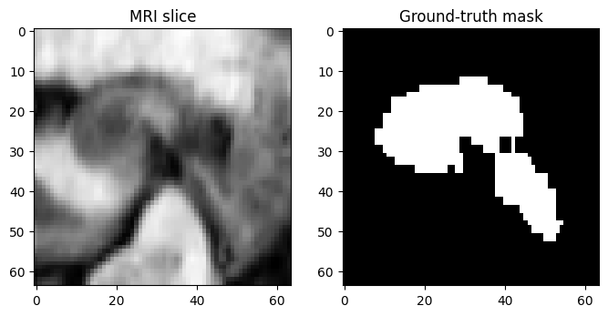
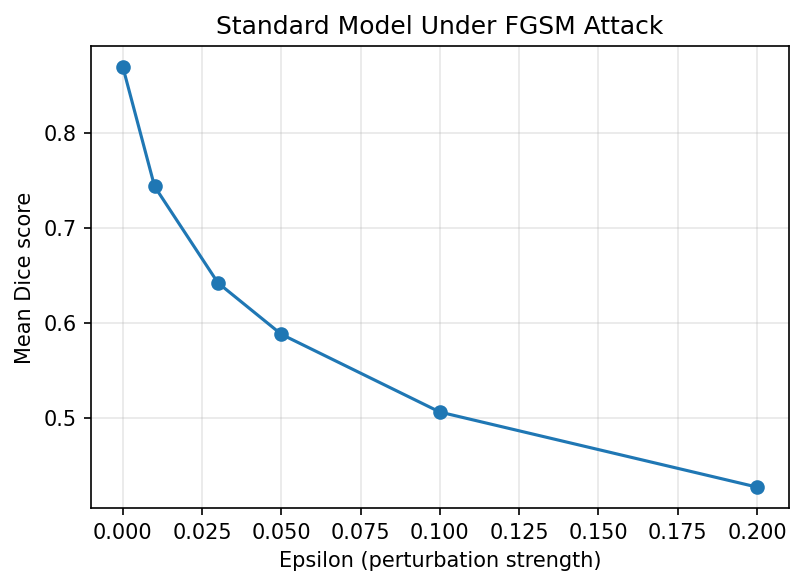
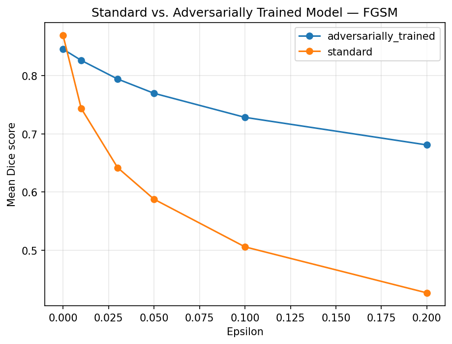
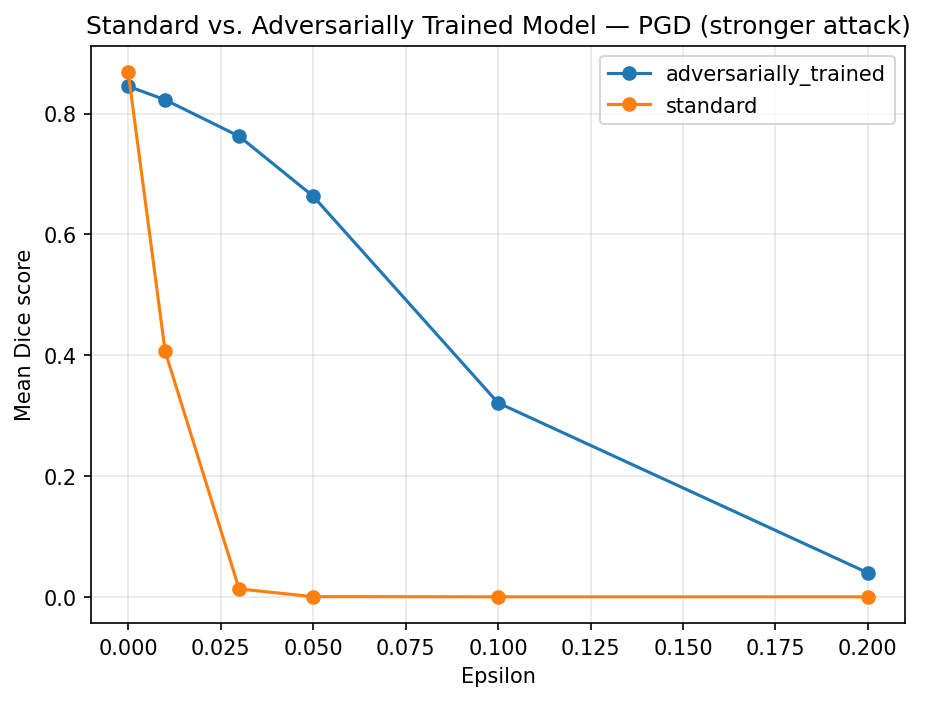
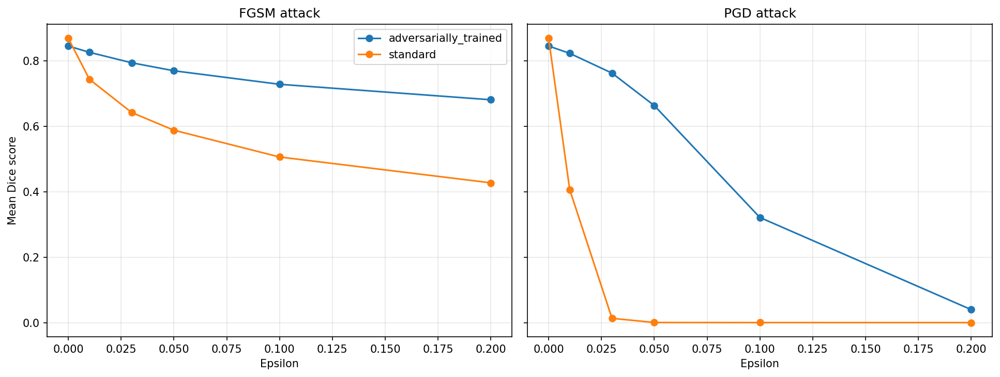
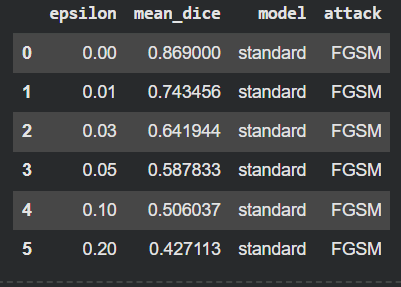
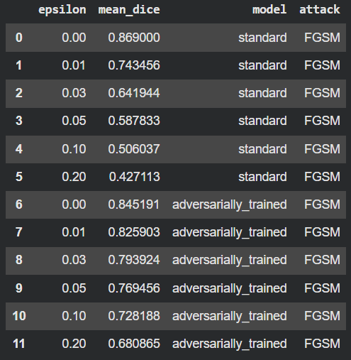
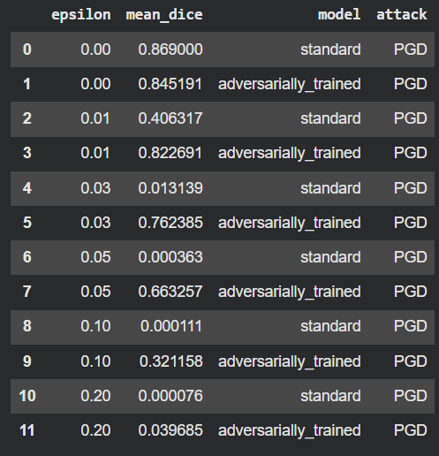

# Adversarial Robustness of Medical Image Segmentation Models

A small research project evaluating how a deep learning segmentation model behaves under adversarial
attacks, and whether adversarial training can make it more robust — validated against a stronger attack
to rule out gradient masking.

## Motivation

Medical imaging models are increasingly deployed in real clinical pipelines, but they are rarely tested
against adversarial perturbations before deployment — small, often imperceptible changes to an input image
that can cause a model to fail. This project asks three questions:

1. How much does a segmentation model's performance degrade under an adversarial attack?
2. Can adversarial training make the model more robust?
3. Is that robustness genuine, or is the model simply learning to defeat one specific attack
   ("gradient masking")?

This sits at the intersection of **AI, cybersecurity, and biomedical engineering** — a robustness
evaluation pipeline that could be applied to any clinical deep learning model before deployment.

## Dataset

- **Medical Segmentation Decathlon — Task04_Hippocampus**
- 3D MRI volumes, binary segmentation (hippocampus vs. background)
- Chosen for its small size, which keeps the full pipeline fast to run end-to-end

## Method

| Stage | Description |
|---|---|
| **1. Baseline model** | 3D UNet ([MONAI](https://monai.io/)) trained on clean data |
| **2. FGSM attack** | Fast Gradient Sign Method — single-step attack, evaluated across a range of perturbation strengths (epsilon) |
| **3. Adversarial training** | A second model trained from scratch on a mix of clean and FGSM-perturbed images at every step |
| **4. PGD validation** | Projected Gradient Descent — a stronger, iterative attack used to check whether the adversarially trained model is genuinely more robust, or only appears robust against FGSM |

Full implementation: [`Adversarial_Robustness_Medical_Segmentation.ipynb`](./Adversarial_Robustness_Medical_Segmentation.ipynb)

## Results

**Segmentation example** (MRI slice, ground truth, and model prediction):

 -->


**Standard model under FGSM attack** — Dice score drops as epsilon increases:

 -->


**Standard vs. adversarially trained model, under FGSM:**

 -->


**Standard vs. adversarially trained model, under the stronger PGD attack:**

 -->


**Side-by-side FGSM vs. PGD comparison:**

 -->


### Key Findings & Adversarial Robustness Analysis

> The standard model's Dice score dropped from **0.869** (clean) to **0.427** under FGSM at epsilon = 0.2.

> **FGSM Results:**

 -->

> Adversarial training improved robustness under FGSM, raising Dice at epsilon = 0.2 from **0.427** to **0.681**.

**FGSM Results:**

 -->

> However, under the stronger PGD attack, the robustness gap **narrowed**, suggesting the adversarially trained model **shows signs of gradient masking** (dropping to 0.040 under PGD at epsilon = 0.2, failing against iterative optimization attacks).

**PGD Results:**

 -->


## Tech Stack

- **PyTorch** + **[MONAI](https://monai.io/)** — 3D medical image segmentation
- **FGSM & PGD** — adversarial attack implementations (from scratch)
- Google Colab (GPU runtime)

## How to Run

1. Open [`Adversarial_Robustness_Medical_Segmentation.ipynb`](./Adversarial_Robustness_Medical_Segmentation.ipynb) in Google Colab.
2. Set the runtime to GPU (**Runtime > Change runtime type > T4 GPU**).
3. Run all cells in order. Total runtime: ~45–60 minutes.

## Project Structure

```
.
├── Adversarial_Robustness_Medical_Segmentation.ipynb   # full pipeline: training, FGSM, adversarial training, PGD
├── images/                                             # result plots (add after running the notebook)
└── README.md
```

Author

FATMANUR — M.Sc. student in Biomedical Engineering, working on deep learning for medical image
segmentation.
