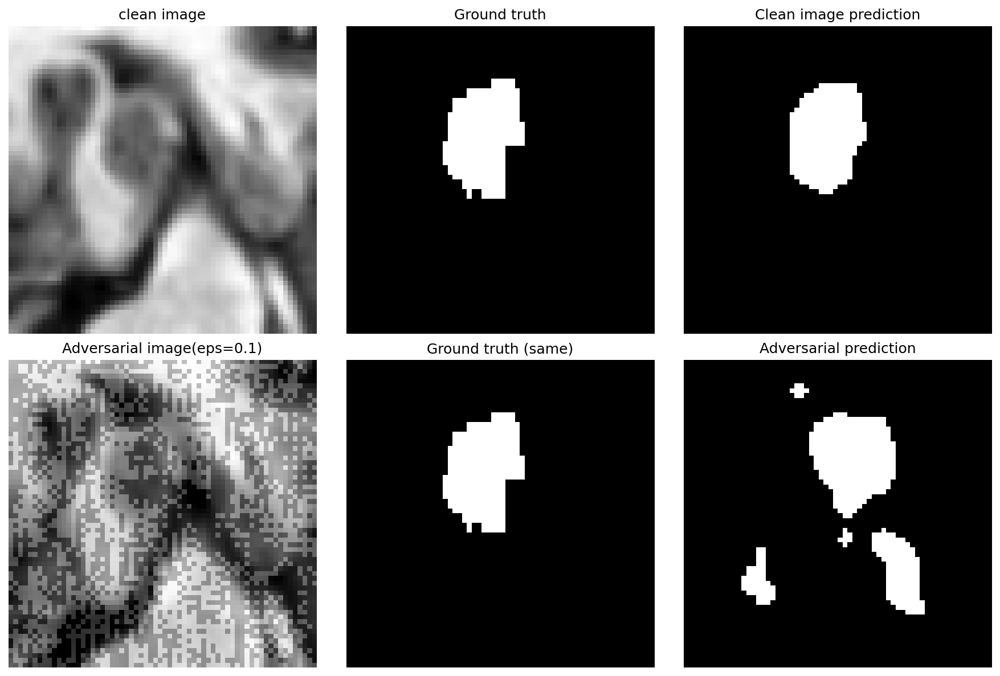
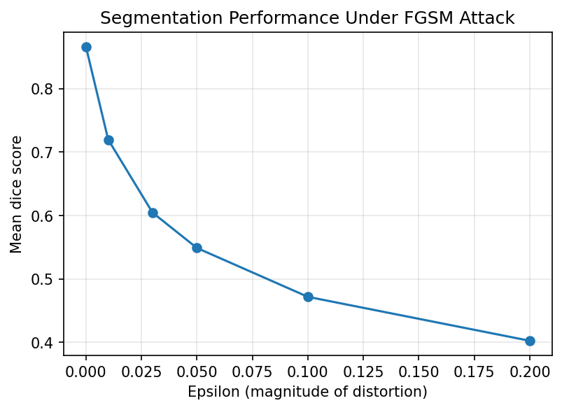

# Secure-med-segmentation
Adversarial attacks (FGSM/PGD) and robustness evaluation on UNet models for medical image segmentation

Projenin amacı: MONAI ile segmentasyon + adversarial robustness değerlendirmesi

Kullanılan veri seti: Medical Segmentation Decathlon - Task04_Hippocampus

Elde edilen Dice skorları: Temiz vs. farklı epsilon değerleri

### Visual Comparison of the Attack
Here is how the FGSM attack degrades the segmentation performance:

### Dice Score Degradation Curve
The chart below demonstrates the dramatic drop in Dice Score as adversarial perturbation (epsilon) increases:

Özet: Model epsilon arttıkça performans kaybediyor, bu da klinik dağıtım öncesi adversarial robustness testinin önemini gösteriyor.
